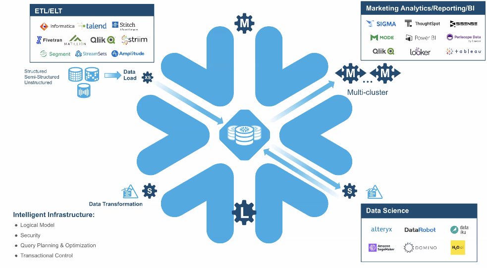

# snowflake

credit: snowflake

# data warehouse
centralized analytics for structured business data

# data lakehouse
transactional data lake for unified analytics. AI/ML collaborative worklords.

# data lake
unlimited storage for versatile data tyes and workloads

# data mesh/fabric
distributed and governed. domain oriented collaboration
